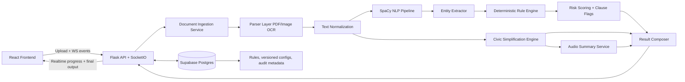
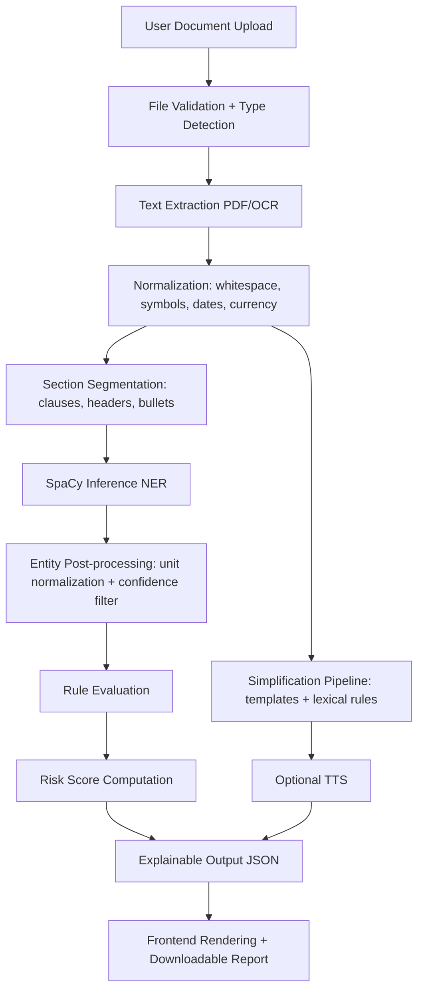
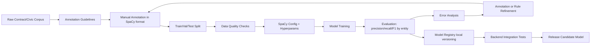
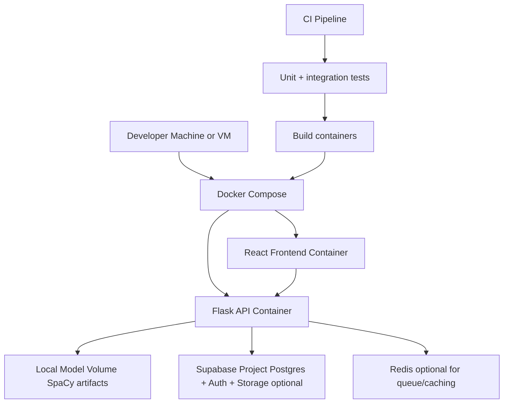

# Nivaran
AI-Powered Civic and Legal Document Analysis Platform

Nivaran is a hybrid AI system for analyzing rental agreements, civic notices, electricity bills, and other public/legal communications. The platform is designed for explainability, deterministic behavior, and deployment on standard hardware without external AI APIs.

## Goals and Constraints

- No external AI APIs.
- NLP built using SpaCy.
- Deterministic, explainable legal reasoning.
- Efficient runtime on standard academic hardware.
- Feasible execution within a 4-month project timeline.

## Scope

### Rent-Right

Analyzes rental agreements and extracts legal entities such as rent amount, security deposit, lock-in period, due dates, and penalty clauses, then applies a rule engine to detect risky terms.

### Civic-Ease

Processes government notices and utility documents, simplifies complex legal/civic text, and optionally provides audio summaries for accessibility.

## High-Level System Architecture



## Data Pipeline Architecture



## SpaCy Training Pipeline



## Deployment Architecture



## Two-Phase Development Plan

## Phase 1: Foundational Intelligence and End-to-End MVP

### 1. Phase Objective

Deliver a working end-to-end system for rental agreement analysis with deterministic risk detection, explainable outputs, and real-time status updates.

### 2. Core Features Implemented

- Rental document upload and parsing (PDF and image OCR).
- Rent-Right entity extraction (core contract fields).
- Rule-based risk flagging and risk score generation.
- Realtime processing progress via WebSockets.
- Initial frontend report view with clause-level explanations.

### 3. Technical Components Built

- Flask application skeleton with modular service layer.
- SocketIO event protocol for progress states.
- Supabase schema for rule storage and analysis metadata.
- Rule evaluation engine with deterministic operators.
- Structured JSON output contract between backend and frontend.

### 4. NLP Components Developed

- SpaCy NER baseline model with initial entity set:
    - RENT_AMOUNT
    - DEPOSIT_AMOUNT
    - LOCKIN_PERIOD
    - DUE_DATE
    - PENALTY_CLAUSE
    - TERMINATION_CONDITION
- Entity normalization utilities (currency, duration, date).
- Inference wrapper with confidence thresholding.

### 5. Backend Components Developed

- Upload API and document processing orchestration.
- Parser adapters (PDF extraction + OCR fallback).
- Rule engine module and explainability formatter.
- Supabase repository layer:
    - `rules`
    - `rule_versions`
    - `analysis_runs`
    - `risk_findings`
- Logging, error handling, and deterministic retry policy.

### 6. Frontend Components Developed

- Upload workflow and processing timeline UI.
- Entity extraction panel.
- Risk findings panel with severity and reasons.
- Final summary card with risk score and clause highlights.

### 7. Deliverables Produced

- Running MVP (Rent-Right only) with local deployment.
- Trained baseline SpaCy model artifact.
- Rule set v1 in Supabase.
- API and WebSocket interface documentation.
- Test suite for key extraction and rules.

### 8. Evaluation Metrics

- NER entity-level F1 (target >= 0.82 baseline).
- Rule engine consistency (same input => same output, 100%).
- Critical risk recall (target >= 0.95 on labeled validation set).
- End-to-end latency per document (target <= 7 seconds median).
- WebSocket progress event reliability (target >= 99%).

### 9. Risks and Mitigation Strategies

- Risk: Low OCR quality on scanned legal documents.
    - Mitigation: Add image pre-processing and confidence gating.
- Risk: Sparse annotated legal data for NER.
    - Mitigation: Focused annotation sprints and active error-driven relabeling.
- Risk: Rule conflicts producing noisy outputs.
    - Mitigation: Rule versioning, precedence order, and regression tests.

## Phase 2: Civic-Ease Expansion, Hardening, and Deployment Readiness

### 1. Phase Objective

Expand to civic document simplification and audio summaries, improve model and rule coverage, and harden the platform for stable demonstrations and academic evaluation.

### 2. Core Features Implemented

- Civic-Ease text simplification for notices and bills.
- Optional audio explanation generation.
- Multi-template explanation engine for different document categories.
- Admin workflow for rule/version management.
- Exportable reports (JSON/PDF).

### 3. Technical Components Built

- Simplification module with deterministic transformation templates.
- Audio generation pipeline (offline/local TTS).
- Supabase-backed rules admin and audit fields.
- Monitoring dashboard for latency and model quality drift indicators.
- CI pipeline for model + rule regression tests.

### 4. NLP Components Developed

- NER model v2 with expanded entities (e.g., PAYMENT_FREQUENCY, BILL_DUE_WINDOW).
- Domain adaptation for civic notices and utility text patterns.
- Simplification quality rubric and sentence transformation rules.
- Entity-linked explanation generation templates.

### 5. Backend Components Developed

- Civic-Ease API endpoints and orchestration service.
- Simplification and TTS service modules.
- Authentication/authorization hooks for admin routes.
- Supabase policies and migration scripts.
- Batch evaluation scripts and benchmark endpoints.

### 6. Frontend Components Developed

- Civic document analysis view.
- Simplified explanation viewer with side-by-side original text.
- Audio playback widget.
- Rule admin screens (restricted role).
- Metrics and run-history view.

### 7. Deliverables Produced

- Full dual-module release (Rent-Right + Civic-Ease).
- SpaCy model v2 and evaluation report.
- Supabase schema migrations and seed scripts.
- Deployment artifacts (Docker Compose and environment docs).
- Final project report and demo script.

### 8. Evaluation Metrics

- NER F1 improvement from phase 1 baseline (target +8-12%).
- Simplification readability gain (e.g., reduction in grade-level score).
- Human evaluation for explanation clarity (target >= 4/5 mean).
- P95 end-to-end latency (target <= 10 seconds with OCR).
- System uptime during demo window (target >= 99%).

### 9. Risks and Mitigation Strategies

- Risk: Simplification may oversimplify legal meaning.
    - Mitigation: Template constraints + legal-preservation checks.
- Risk: Increased latency from extra pipelines (simplification + audio).
    - Mitigation: Async processing and staged result streaming.
- Risk: Supabase connectivity interruptions.
    - Mitigation: Local cached rule snapshot and retry/backoff.

## Engineering Timeline (4 Months)

- Month 1: Dataset curation, annotation guidelines, backend scaffolding, Supabase schema design.
- Month 2: SpaCy baseline training, Rent-Right pipeline, rule engine v1, frontend MVP.
- Month 3: Civic-Ease module, model v2, simplification + audio, admin and evaluation tooling.
- Month 4: Hardening, regression testing, latency tuning, deployment packaging, documentation.

## Proposed Project Folder Structure

```text
nivaran/
    backend/
        app.py
        config.py
        requirements.txt
        routes/
            health.py
            analyze.py
            civic.py
            admin_rules.py
        services/
            ingestion/
                file_validator.py
                pdf_parser.py
                ocr_parser.py
            nlp/
                spacy_infer.py
                entity_normalizer.py
            rules/
                engine.py
                operators.py
                explain.py
            civic/
                simplifier.py
                templates.py
                tts.py
            realtime/
                socket_events.py
        repositories/
            supabase_client.py
            rules_repository.py
            runs_repository.py
        tests/
            test_rules_engine.py
            test_entity_extraction.py
            test_api_contracts.py

    frontend/
        package.json
        src/
            app/
            pages/
                RentRight.jsx
                CivicEase.jsx
                RunHistory.jsx
            components/
                UploadPanel.jsx
                ProgressTimeline.jsx
                RiskSummary.jsx
                ClauseFlags.jsx
                SimplifiedView.jsx
                AudioPlayer.jsx
            services/
                api.js
                socket.js

    nlp/
        data/
            raw/
            annotated/
            processed/
        configs/
            base.cfg
            ner_v1.cfg
            ner_v2.cfg
        scripts/
            convert_annotations.py
            split_dataset.py
            train_spacy.py
            evaluate_spacy.py
            error_analysis.py
        models/
            legal_ner_v1/
            legal_ner_v2/

    infra/
        docker/
            Dockerfile.backend
            Dockerfile.frontend
        docker-compose.yml
        supabase/
            migrations/
            seed/

    docs/
        architecture.md
        api_spec.md
        annotation_guidelines.md
        evaluation_plan.md

    scripts/
        run_local.sh
        run_tests.sh
```

## Supabase Data Model

- `rules`: rule definition, category, severity, enabled flag.
- `rule_versions`: immutable snapshots for reproducibility.
- `analysis_runs`: document metadata, timing, module type, model version.
- `risk_findings`: per-clause findings, rule id, explanation, score contribution.
- `system_metrics`: optional runtime metrics for evaluation dashboards.

## Evaluation Strategy

- Offline evaluation:
    - Entity-level precision, recall, F1 by class.
    - Rule-level confusion matrix for risk flags.
- Online/system evaluation:
    - API latency, WS event coverage, failure rate.
    - End-user readability and comprehension tests.
- Reproducibility:
    - Fixed model version + fixed rule version per run.

## Explainability and Determinism Guarantees

- Every risk output includes:
    - matched text span
    - extracted entity
    - rule id and version
    - deterministic condition triggered
    - score contribution
- No probabilistic black-box decisioning in legal risk scoring.
- All production rule changes tracked via versioned records in Supabase.